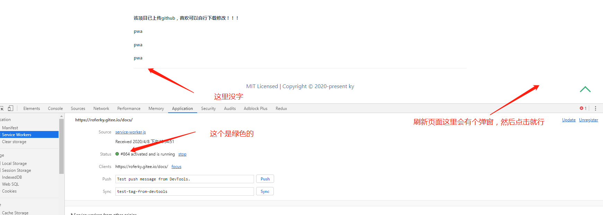
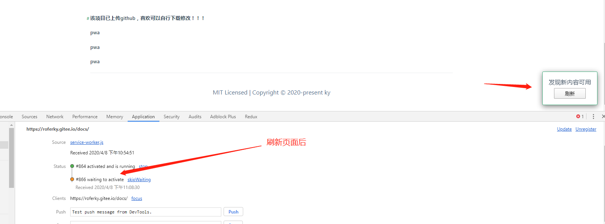
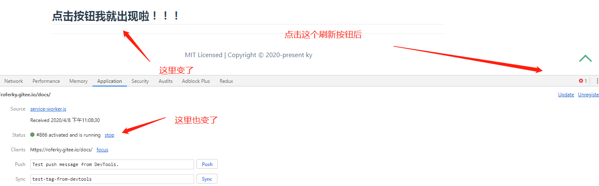

## 项目安装的官方插件
按装插件后会多出lock文件，是锁定版本用的，不要管，但是要提交到代码仓[官方插件地址](https://vuepress.github.io/en/)
1. [进入一个页面就有一个横条加载：nprogress](https://vuepress.github.io/en/plugins/nprogress/)
2. [回到顶部：@vuepress/back-to-top](https://v1.vuepress.vuejs.org/zh/plugin/official/plugin-back-to-top.html#%E5%AE%89%E8%A3%85)
3. [serwork服务 ：@vuepress/pwa](https://v1.vuepress.vuejs.org/zh/plugin/official/plugin-pwa.html)

## 安装官方插件的坑
 1. back-to-top ：这垃圾前面没生效，后面不知道怎么的又可以了，反正一直都是bable方式配置
 2. @vuepress/pwa ：
  - manifest问题，有报错。
  - github的pages推送体验差因为网络问题，建议把代码更新在gitee尝试（已体验）
 
 
 
 3.vssue ：由于gitee问题，目前只实现了github的账号评论功能，还有就是没有全局设置vssue组件
 
 ### [回到主页](/) [教程](https://vuepress.vuejs.org/zh/guide/markdown.html#%E9%93%BE%E6%8E%A5)<!-- 跳转到根部的 README.md -->

 ## 评论功能:

##### 一.目前在github的域名下才有评论功能[https://roferjack.github.io/docs/](https://roferjack.github.io/docs/)
gitee授权有问题[Gitee OAuth 授权出错](https://github.com/meteorlxy/vssue/issues/60)

<Vssue/>
