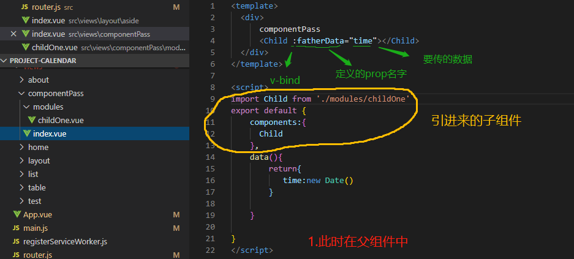

## 一.父传子
#### [v-bind](https://cn.vuejs.org/v2/api/#v-bind) 绑定 [prop](https://cn.vuejs.org/v2/api/#props) 动态传值 
#### [props](https://cn.vuejs.org/v2/api/#props)
#### 1.具体操作
(1). 在父组件中：给绑定的prop取一个有语义化的名字，然后将需要传的值赋给这个prop属性。如图1：
  
(2). 在子组件中：在子组件必须声明props选项，并将在父组件中定义的语义话名字放到这个选项中，可以使用字符串数组的形式，也可以使用对象的形式（可以验证传值类型，方便找错和测试）
  

(3). prop可以[传的类型](https://cn.vuejs.org/v2/guide/components-props.html#%E4%BC%A0%E5%85%A5%E4%B8%80%E4%B8%AA%E6%95%B0%E5%AD%97)，props可以[验证的类型](https://cn.vuejs.org/v2/guide/components-props.html#%E7%B1%BB%E5%9E%8B%E6%A3%80%E6%9F%A5)

#### 2.拓展

(1). 为什么说是单向数据流，因为防止从子组件意外改变父级组件的状态，从而导致你的应用的数据流向难以理解，违反则会控制台中发出警告[地址](https://cn.vuejs.org/v2/guide/components-props.html#%E5%8D%95%E5%90%91%E6%95%B0%E6%8D%AE%E6%B5%81)

(2). 这里传值可以是静态的(像html标签一样添加属性)动态的（v-bind绑定动态追）[地址](https://cn.vuejs.org/v2/guide/components-props.html#%E4%BC%A0%E9%80%92%E9%9D%99%E6%80%81%E6%88%96%E5%8A%A8%E6%80%81-Prop)

## 二.子传父
#### 利用[v-on](https://cn.vuejs.org/v2/api/#vm-on)监听实例（即子组件）自定义事件，其回调函数会接收所有传入事件触发函数的额外参数[$emit](https://cn.vuejs.org/v2/api/#vm-emit)在子组件触发事件，父组件内v-on接收

## 三.兄弟传值

## 四.隔代传值

## 五.页面传值

## 六.

